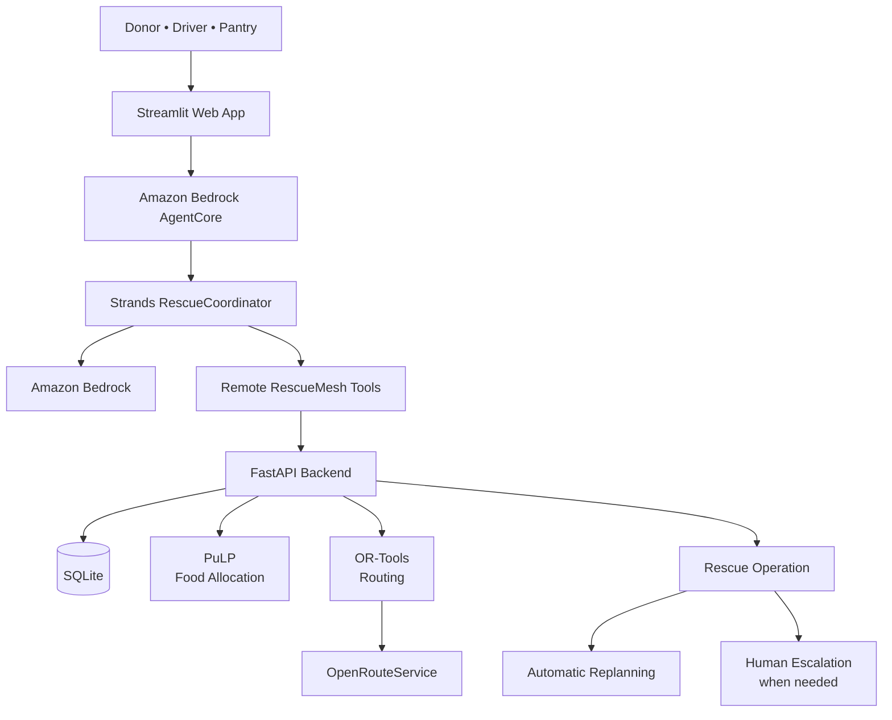

# RescueMesh

### Autonomous food rescue coordination with Strands Agents and Amazon Bedrock AgentCore

[](https://18-213-41-214.nip.io)


**RescueMesh** coordinates surplus food from donors to community pantries through volunteer drivers.

Instead of only suggesting what someone should do, RescueMesh handles the rescue workflow end to end:

**donation → planning → driver dispatch → delivery → pantry confirmation**

Built for the **AWS Agents for Humans Hackathon — Good Neighbor Agents** track.

🌐 **Live Demo:** https://18-213-41-214.nip.io

---

## Why RescueMesh?

Food rescue is a coordination problem.

When surplus food becomes available, someone has to quickly answer:

- Which pantry needs this food?
- How much can it accept?
- Which driver is available?
- Can the rescue happen before the deadline?
- What if a driver cancels?
- What if a pantry becomes unavailable?

RescueMesh combines an AI coordination agent with deterministic logistics optimization to make those decisions safely.

---

## How It Works

```text
Donor creates donation
        ↓
Strands RescueCoordinator
        ↓
Inspect donation + network state
        ↓
Deterministic logistics optimizer
        ↓
Assign pantry + driver + route
        ↓
Driver accepts and picks up food
        ↓
Driver reports delivery
        ↓
Pantry independently confirms receipt
        ↓
Rescue completed
```

If something changes during the rescue, RescueMesh can automatically replan.

If there is no clearly safe alternative, the system pauses and creates a **human escalation** instead of allowing the LLM to guess.

---

## Core Design

> **LLMs orchestrate. Deterministic algorithms optimize.**

The AI agent handles:

- reasoning about the rescue state;
- selecting tools;
- coordinating workflow;
- responding to disruptions;
- deciding when human input is required.

The logistics engine handles:

- pantry allocation;
- driver capacity;
- driver availability;
- deadlines;
- routes;
- travel times.

This means the LLM does **not** invent quantities, routes, capacities, or ETAs.

---

## Architecture



The public application is hosted on **Amazon EC2** behind **Nginx + HTTPS**.

The website invokes the deployed RescueCoordinator through an IAM-authorized **Amazon Bedrock AgentCore Runtime**.

---

## Key Features

### 🤖 Autonomous Rescue Planning
A donor submission can automatically trigger the Strands agent to inspect the network and create a rescue plan.

### 🚚 Driver & Pantry Matching
RescueMesh assigns available volunteer drivers and allocates food to pantries with matching need and capacity.

### 🗺️ Optimized Routing
PuLP, OR-Tools, and OpenRouteService handle deterministic allocation and routing.

### 🔄 Disruption Recovery
Driver cancellations, pantry closures, and capacity changes can trigger automatic replanning.

### 🧑 Human-in-the-Loop
When there is no safe deterministic choice, RescueMesh pauses and asks a human to decide.

### ✅ Verified Delivery
A driver reporting delivery is not enough. The pantry must independently confirm that the food was received.

---

## Live Demo

The application contains six views:

- **Donor** — create surplus-food donations
- **Driver Dispatch** — view assignments and routes
- **Pantry** — confirm received food
- **Operations** — inspect rescue state and events
- **Impact & Evaluation** — review system results
- **Live Rescue Demo** — walk through the rescue lifecycle

### Recommended Demo

Create:

```text
Donor: Community Bakery
Food: Prepared Food
Quantity: 50 lbs
Available: 11:00
Pickup deadline: 14:00
```

Then follow:

```text
Donor
  ↓
Driver Dispatch
  ↓
Live Rescue Demo
  ↓
Pantry Confirmation
  ↓
Operations
```

The optimizer may select different drivers or pantries depending on the current network state.

---

## Technology Stack

| Component | Technology |
|---|---|
| Agent | Strands Agents SDK |
| Agent Runtime | Amazon Bedrock AgentCore |
| LLM | Amazon Bedrock / Claude Haiku |
| Frontend | Streamlit |
| Backend | FastAPI |
| Allocation | PuLP |
| Routing | Google OR-Tools |
| Travel Times | OpenRouteService |
| Database | SQLite |
| Hosting | Amazon EC2 |
| Security | AWS IAM + HTTPS |

---

## Evaluation

RescueMesh was evaluated using automated tests and reproducible randomized logistics scenarios.

### Automated Tests

The project currently has:

**53 passing automated tests**

```bash
pytest tests/ -q
```

These tests cover planning constraints, driver availability, capacity limits, deadlines, routing behavior, disruption recovery, and workflow state transitions.

### Randomized Logistics Benchmark

Using a reproducible benchmark with `seed=42`, RescueMesh was evaluated on **50 randomized planning scenarios**.

| Metric | Result |
|---|---:|
| Randomized planning scenarios | 50 |
| Rescue plans generated | 46 / 50 (92%) |
| Fully rescued scenarios | 46 / 50 (92%) |
| Safely rejected infeasible scenarios | 4 / 50 (8%) |
| Safety compliance among generated plans | 46 / 46 (100%) |
| Weighted food rescued | 89.62% |
| Unsafe plans | 0 |
| Capacity violations | 0 |
| Driver double-booking violations | 0 |
| Driver shift violations | 0 |
| Pickup deadline violations | 0 |
| Average planning latency | 6.42 s |
| P95 planning latency | 6.63 s |

All generated rescue plans passed the benchmark's independent safety checks. When a randomized scenario had no feasible rescue, RescueMesh safely rejected it rather than producing an invalid plan.

### Disruption Recovery

The benchmark also simulated **10 in-transit pantry-closure disruptions**.

| Metric | Result |
|---|---:|
| Disruption scenarios | 10 |
| Autonomous recoveries | 10 / 10 (100%) |
| Unsafe autonomous recoveries | 0 |
| Average disruption recovery latency | 0.79 s |

The 100% recovery result applies specifically to the tested in-transit pantry-closure scenarios and should not be interpreted as a 100% recovery rate for every possible disruption type.

### Reproducibility

The benchmark can be rerun with:

```bash
python evaluation/randomized_benchmark.py \
  --planning 50 \
  --disruptions 10 \
  --seed 42
```

Detailed benchmark outputs are stored in:

```text
evaluation/results/
├── planning_scenarios.csv
├── disruption_scenarios.csv
├── benchmark_summary.json
└── benchmark_summary.md
```

## Run Locally

```bash
git clone https://github.com/maithili74/rescuemesh
cd rescuemesh

python3 -m venv venv
source venv/bin/activate

pip install --upgrade pip
pip install -r requirements.txt
```

Create your environment file:

```bash
cp .env.example .env
```

Configure:

```env
ORS_API_KEY=
RESCUEMESH_INTERNAL_API_KEY=
RESCUEMESH_BACKEND_URL=http://127.0.0.1:8000

AGENTCORE_RUNTIME_ARN=
AWS_REGION=us-east-1
AGENTCORE_QUALIFIER=DEFAULT
```

Start the backend:

```bash
uvicorn app.api.main:app --host 127.0.0.1 --port 8000
```

Start the frontend in another terminal:

```bash
streamlit run app/dashboard/streamlit_app.py
```

Then open:

```text
http://localhost:8501
```

---

## Repository Structure

```text
app/
├── agent/          # Strands + AgentCore integration
├── api/            # FastAPI backend
├── dashboard/      # Streamlit application
├── services/       # Planning and routing logic
└── tools/          # Agent tools

deploy/
└── agentcore/      # Lightweight AgentCore deployment package

tests/              # Automated tests
```

---

## Limitations

RescueMesh is a hackathon prototype.

The current system uses:

- simulated donors, pantries, and drivers;
- SQLite rather than a production distributed database;
- web-based event simulation rather than production mobile apps;
- OpenRouteService for routing.

A production deployment would add stronger authentication, observability, monitoring, and multi-user infrastructure.

---

## License

Licensed under the **MIT License**.

See [LICENSE](LICENSE).