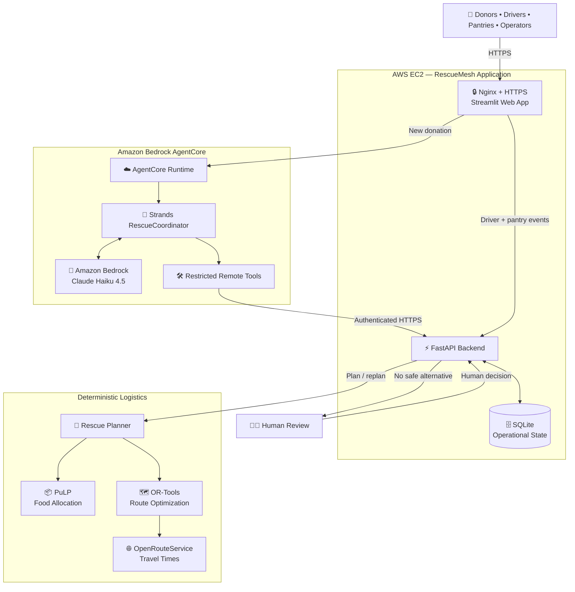

# RescueMesh

### Autonomous food rescue coordination with Strands Agents and Amazon Bedrock AgentCore

[](https://18-213-41-214.nip.io)


**RescueMesh** is an autonomous food-rescue coordination system that turns surplus food into an executable rescue operation.

It connects **donors, volunteer drivers, community pantries, and rescue operators**, then coordinates the complete workflow: food allocation, driver assignment, route planning, pickup, delivery, disruption recovery, and verified pantry receipt.

Unlike a chatbot that only recommends what people should do, RescueMesh performs the operational coordination itself while keeping critical logistics decisions deterministic and escalating to a human when automation should stop.

**Donation → AI coordination → deterministic planning → dispatch → delivery → verified receipt**

Built for the **AWS Agents for Humans Hackathon — Good Neighbor Agents** track.

🌐 **Live Demo:**  
https://18-213-41-214.nip.io

---

## Why RescueMesh?

Food rescue is not just a matching problem — it is a **real-time coordination problem**.

When surplus food becomes available, someone has to quickly determine:

- Which pantry currently needs it?
- How much can each pantry accept?
- Which volunteer driver is available?
- Can pickup happen before the deadline?
- Can the driver complete the route within capacity and shift constraints?
- What happens if a driver cancels or a pantry becomes unavailable?
- When should the system automatically recover?
- When should a human make the decision?

RescueMesh turns these interconnected decisions into a **stateful, end-to-end rescue workflow**.

---

## Key Features

| Feature | What RescueMesh Does |
|---|---|
| 🤖 **Autonomous Coordination** | A Strands agent inspects rescue state, selects tools, and coordinates the workflow |
| 🚚 **Driver & Pantry Matching** | Matches available drivers with pantries based on need, capacity, and timing |
| 🗺️ **Optimized Logistics** | Uses PuLP, OR-Tools, and OpenRouteService instead of asking an LLM to calculate routes |
| 🔄 **Disruption Recovery** | Replans when drivers or pantries become unavailable |
| 🧑‍💼 **Human-in-the-Loop** | Escalates when no clearly safe deterministic alternative exists |
| ✅ **Verified Delivery** | Requires independent pantry confirmation after the driver reports delivery |
| 📋 **Persistent Operations** | Stores routes, stops, events, and escalations outside the LLM conversation |
| 📊 **Evaluation** | Includes automated tests and reproducible randomized logistics benchmarks |

---

## Live Demo

🌐 **https://18-213-41-214.nip.io**

The application includes:

- **Donor** — create a surplus-food donation
- **Driver Dispatch** — view the generated assignment and route
- **Pantry** — confirm received food
- **Operations** — inspect rescue state and event history
- **Impact & Evaluation** — view system results
- **Live Rescue Demo** — walk through the rescue lifecycle

### Recommended Demo

Create this donation from the **Donor** page:

```text
Donor: Community Bakery
Food: Prepared Food
Quantity: 50 lbs
Available: 11:00
Pickup deadline: 14:00
```

Then follow:

```text
Donor
  ↓
Driver Dispatch
  ↓
Live Rescue Demo
  ↓
Pantry Confirmation
  ↓
Operations
  ↓
Impact & Evaluation
```

RescueMesh may select different drivers or pantry combinations depending on the current network state. Follow the plan the system actually generates.

> Demo controls represent events that would normally come from a driver's phone, SMS link, or lightweight mobile application. They still use the real RescueMesh backend workflow.

---

## How It Works

A normal rescue follows this lifecycle:

```text
Donation Created
      ↓
Inspect Donation + Network
      ↓
Generate Rescue Plan
      ↓
Allocate Food + Assign Driver
      ↓
Optimize Route
      ↓
Driver Accepts
      ↓
Pickup
      ↓
Delivery
      ↓
Pantry Confirms Receipt
      ↓
Rescue Completed
```

If something changes:

```text
Disruption
    ↓
Updated Network State
    ↓
Deterministic Replanning
    ↓
┌───────────────────────┬───────────────────────┐
│ Safe alternative      │ No safe alternative   │
▼                       ▼
Automatic recovery      Human review
```

---

# Architecture

> **LLMs orchestrate. Deterministic algorithms optimize.**

RescueMesh separates AI coordination from logistics optimization and real-world state changes.

The Strands agent determines **what should happen next**.  
Deterministic services determine **whether and how it can happen safely**.



### Architecture at a Glance

**1. Application layer**  
The public RescueMesh interface runs on **AWS EC2** using Streamlit behind **Nginx + HTTPS**. FastAPI provides the backend interface and SQLite stores persistent rescue state.

**2. AI coordination layer**  
A new donation invokes **Amazon Bedrock AgentCore Runtime**, where the **Strands RescueCoordinator** uses Amazon Bedrock for reasoning and selects restricted RescueMesh tools.

**3. Deterministic logistics layer**  
The LLM never calculates routes, quantities, capacities, or ETAs.

- **PuLP** handles food-to-pantry allocation.
- **Google OR-Tools** handles driver route optimization.
- **OpenRouteService** provides road travel times.

**4. Real-world state remains verifiable**  
Driver acceptance, pickup, delivery, pantry confirmation, and human approval are not fabricated by the AI agent. They must enter through the corresponding RescueMesh workflow.

**5. Human oversight remains explicit**  
If deterministic replanning cannot produce a clearly safe alternative, RescueMesh escalates the rescue instead of allowing the LLM to guess.

### Live AWS Flow

```text
User
 ↓
Streamlit on AWS EC2
 ↓
Amazon Bedrock AgentCore
 ↓
Strands RescueCoordinator
 ↓
Amazon Bedrock
 ↓
Restricted Remote Tools
 ↓
FastAPI
 ↓
Deterministic Planner
 ↓
PuLP + OR-Tools + OpenRouteService
 ↓
Persistent Rescue Operation
```

---

## Evaluation

RescueMesh was evaluated using automated tests and reproducible randomized logistics scenarios.

### Automated Testing

**53 automated tests passing**

```bash
pytest tests/ -q
```

The test suite covers planning constraints, capacity, driver availability, deadlines, routing, disruption recovery, and workflow state.

### Randomized Planning Benchmark

Using `seed=42`, RescueMesh was evaluated on **50 randomized planning scenarios**.

| Metric | Result |
|---|---:|
| Planning scenarios | **50** |
| Rescue plans generated | **46 / 50 (92%)** |
| Fully rescued scenarios | **46 / 50 (92%)** |
| Safely rejected infeasible scenarios | **4 / 50 (8%)** |
| Safety compliance among generated plans | **46 / 46 (100%)** |
| Weighted food rescued | **89.62%** |
| Average planning latency | **6.42 s** |
| P95 planning latency | **6.63 s** |

All generated plans passed the benchmark's independent safety checks.

When no feasible rescue existed, RescueMesh safely rejected the scenario rather than producing an invalid plan.

### Disruption Recovery

The benchmark also simulated **10 in-transit pantry closures**.

| Metric | Result |
|---|---:|
| Disruption scenarios | **10** |
| Autonomous recoveries | **10 / 10 (100%)** |
| Unsafe autonomous recoveries | **0** |
| Average recovery latency | **0.79 s** |

The recovery result applies specifically to the tested pantry-closure scenarios and should not be interpreted as a 100% recovery rate for every possible disruption.

### Reproduce the Benchmark

```bash
python evaluation/randomized_benchmark.py \
  --planning 50 \
  --disruptions 10 \
  --seed 42
```

Detailed results are available in:

```text
evaluation/results/
├── planning_scenarios.csv
├── disruption_scenarios.csv
├── benchmark_summary.json
└── benchmark_summary.md
```

---

## Technology Stack

| Layer | Technology |
|---|---|
| Agent Framework | Strands Agents SDK |
| Agent Runtime | Amazon Bedrock AgentCore |
| Foundation Model | Amazon Bedrock / Claude Haiku 4.5 |
| Frontend | Streamlit |
| Backend | FastAPI |
| Food Allocation | PuLP |
| Route Optimization | Google OR-Tools |
| Travel-Time Data | OpenRouteService |
| Operational State | SQLite |
| Hosting | Amazon EC2 |
| Authorization | AWS IAM |
| Reverse Proxy | Nginx |
| HTTPS | Let's Encrypt |
| Language | Python |

---

## Run Locally

```bash
git clone https://github.com/maithili74/rescuemesh.git
cd rescuemesh

python3 -m venv venv
source venv/bin/activate

pip install --upgrade pip
pip install -r requirements.txt

cp .env.example .env
```

Configure `.env`:

```env
ORS_API_KEY=

RESCUEMESH_INTERNAL_API_KEY=

RESCUEMESH_BACKEND_URL=http://127.0.0.1:8000

AGENTCORE_RUNTIME_ARN=

AWS_REGION=us-east-1

AGENTCORE_QUALIFIER=DEFAULT
```

Start FastAPI:

```bash
uvicorn app.api.main:app \
  --host 127.0.0.1 \
  --port 8000
```

Start Streamlit in another terminal:

```bash
streamlit run app/dashboard/streamlit_app.py
```

Then open:

```text
http://localhost:8501
```

For AgentCore-backed execution, the AWS environment must have permission to invoke the configured runtime.

Without `AGENTCORE_RUNTIME_ARN`, RescueMesh can use the local Strands coordinator during development.

---

## Repository Structure

```text
rescuemesh/
├── app/
│   ├── agent/          # Strands + AgentCore integration
│   ├── api/            # FastAPI backend
│   ├── dashboard/      # Streamlit application
│   ├── services/       # Planning and routing
│   └── tools/          # Agent tools
│
├── deploy/
│   └── agentcore/      # AgentCore deployment package
│
├── evaluation/
│   ├── randomized_benchmark.py
│   └── results/
│
├── scripts/
├── tests/
├── .env.example
├── LICENSE
├── pyproject.toml
├── requirements.txt
└── README.md
```

---

## Limitations

RescueMesh is a hackathon prototype.

The current implementation uses:

- simulated donors, pantries, and volunteer drivers;
- SQLite instead of a distributed production database;
- web-based driver and pantry interfaces rather than production mobile applications;
- OpenRouteService for routing data.

A production deployment would add stronger identity management, observability, fault tolerance, monitoring, and multi-user infrastructure.

---

## License

RescueMesh is licensed under the **MIT License**.

See [LICENSE](LICENSE).