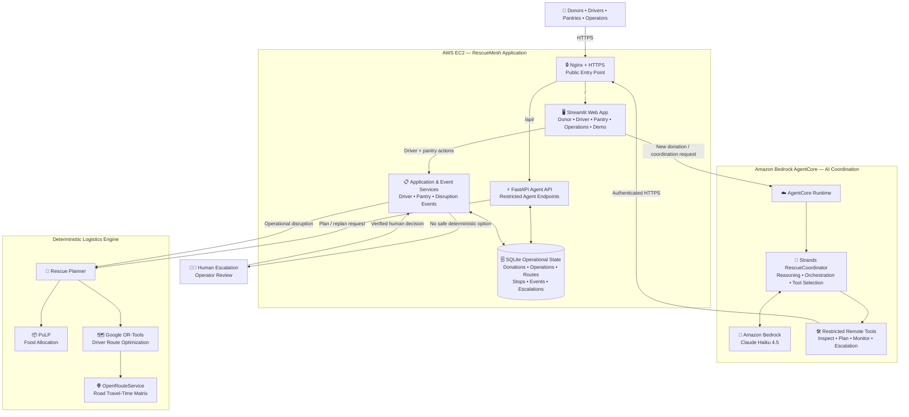

# RescueMesh

### Autonomous food rescue coordination with Strands Agents and Amazon Bedrock AgentCore

[](https://18-213-41-214.nip.io)


**RescueMesh** is an autonomous food-rescue coordination platform that turns surplus food into an executable rescue operation.

It connects donors, volunteer drivers, and community pantries; coordinates rescue decisions through an AI agent; optimizes food allocation and delivery routes with deterministic algorithms; tracks pickup and verified delivery; and safely replans when disruptions occur.

Unlike a chatbot that only suggests what people should do, RescueMesh coordinates the real workflow end to end while keeping logistics decisions deterministic and escalating to a human when automation should stop.

**Donation → AI coordination → deterministic planning → driver dispatch → delivery → pantry verification**

Built for the **AWS Agents for Humans Hackathon — Good Neighbor Agents** track.

🌐 **Live Demo:**  
https://18-213-41-214.nip.io

---

## What Is RescueMesh?

RescueMesh acts as an intelligent coordination layer between **food donors, volunteer drivers, community pantries, and rescue operators**.

When surplus food becomes available, RescueMesh can:

- inspect the donation and current rescue network;
- determine whether a feasible rescue exists;
- allocate food to pantries with matching need and capacity;
- assign available volunteer drivers;
- build feasible delivery routes;
- create and track a persistent rescue operation;
- respond to real-world disruptions;
- automatically replan when a safe alternative exists;
- escalate genuine tradeoffs to a human;
- require independent pantry confirmation before delivery is considered complete.

The goal is not simply to generate advice.

The goal is to **coordinate the rescue itself**.

---

## Why RescueMesh?

Food rescue is not only a matching problem.

It is a **real-time coordination problem**.

When a donation becomes available, someone has to quickly answer:

- Which pantry currently needs this food?
- How much can each pantry accept?
- Which volunteer driver is available?
- Does the driver have enough vehicle capacity?
- Can pickup happen before the deadline?
- Can deliveries finish within the driver's shift?
- Should food be split across multiple pantries?
- What happens if a driver cancels?
- What happens if a pantry suddenly becomes unavailable?
- When should the system automatically replan?
- When should automation stop and ask a human?

These decisions become difficult when donors, drivers, pantries, capacities, deadlines, routes, and unexpected disruptions interact at the same time.

**RescueMesh turns this coordination problem into a stateful autonomous workflow.**

---

## Key Features

### 🤖 Autonomous Rescue Coordination

A donor submission can automatically trigger the Strands-based RescueCoordinator to inspect the donation, examine the current network, and coordinate creation of a rescue plan.

### 🚚 Driver & Pantry Matching

RescueMesh assigns available volunteer drivers and allocates food to pantries according to current need and available capacity.

### 🗺️ Deterministic Logistics Optimization

Critical logistics calculations are handled by:

- **PuLP** for food allocation;
- **Google OR-Tools** for driver routing;
- **OpenRouteService** for road-network travel times.

The LLM does not invent routes, capacities, quantities, or ETAs.

### 🔄 Autonomous Disruption Recovery

Driver failures, pantry closures, capacity changes, and other operational disruptions can trigger a new planning cycle using the latest network state.

### 🧑 Human-in-the-Loop Safety

If RescueMesh cannot identify a clearly safe deterministic alternative, automation stops and the operation is escalated for human review.

### ✅ Two-Sided Delivery Verification

A driver's delivery report does not automatically complete a rescue.

The receiving pantry must independently confirm that the food was received.

### 📋 Persistent Rescue Operations

RescueMesh stores:

- donations;
- rescue operations;
- driver routes;
- delivery stops;
- operational events;
- human escalations.

The rescue therefore exists independently of an LLM conversation.

### 📊 Evaluation & Operational Visibility

Dedicated Operations and Impact & Evaluation views expose rescue state, event history, outcomes, and benchmark results.

---

## Live Demo

🌐 **https://18-213-41-214.nip.io**

The live application contains six primary views:

| View | Purpose |
|---|---|
| **Donor** | Create surplus-food donations and begin coordination |
| **Driver Dispatch** | Review assigned drivers, destinations, quantities, and ETAs |
| **Pantry** | Review inbound food and confirm receipt |
| **Operations** | Inspect active/completed rescues, events, and escalations |
| **Impact & Evaluation** | Review measured system outcomes |
| **Live Rescue Demo** | Follow the rescue lifecycle through guided events |

### Recommended Demo

Open **Donor** and create:

```text
Donor: Community Bakery
Food: Prepared Food
Quantity: 50 lbs
Available: 11:00
Pickup deadline: 14:00
```

Click:

**Create Donation & Start Rescue**

Then follow:

```text
Donor
  ↓
Driver Dispatch
  ↓
Live Rescue Demo
  ↓
Pantry Confirmation
  ↓
Operations
  ↓
Impact & Evaluation
```

During the demo:

1. RescueMesh automatically coordinates a rescue plan.
2. **Driver Dispatch** shows the selected driver, destinations, quantities, and ETAs.
3. **Live Rescue Demo** guides the driver through acceptance, pickup, and delivery.
4. **Pantry** independently confirms that food was received.
5. **Operations** shows the completed rescue and event history.
6. **Impact & Evaluation** shows system-level results.

> The optimizer may choose different drivers or pantry combinations depending on the current network state. Always follow the rescue plan RescueMesh actually generates.

> Demo controls simulate events that would normally come from a driver's phone, SMS link, or lightweight mobile application. They still use the real RescueMesh backend workflow.

---

## How It Works

A normal RescueMesh operation follows this lifecycle:

```text
Donation Created
       ↓
Inspect Donation + Network
       ↓
Generate Deterministic Rescue Plan
       ↓
Allocate Food to Pantries
       ↓
Assign Volunteer Driver
       ↓
Optimize Delivery Route
       ↓
Driver Accepts
       ↓
Driver Picks Up Food
       ↓
Driver Reports Delivery
       ↓
Pantry Confirms Receipt
       ↓
Rescue Completed
```

If something changes during the rescue:

```text
Operational Disruption
        ↓
Inspect Updated State
        ↓
Run Deterministic Replanning
        ↓
┌────────────────────────┬─────────────────────────┐
│ Safe alternative found │ No safe alternative     │
│                        │                         │
▼                        ▼
Automatic recovery       Human escalation
│
▼
Continue rescue
```

---

# Architecture

> ## LLMs orchestrate. Deterministic algorithms optimize.

RescueMesh intentionally separates **AI coordination**, **operational state**, **deterministic logistics**, and **real-world event handling**.

The AI agent determines **what action should happen next**.

Deterministic systems determine **whether that action can actually be executed safely**.



---

## How to Read the Architecture

### 1. User-Facing Application

Donors, volunteer drivers, pantries, and operators interact with the **Streamlit application hosted on AWS EC2**.

Public traffic enters through **Nginx over HTTPS**.

The application provides the donor, driver, pantry, operations, evaluation, and live-demo interfaces.

---

### 2. AI Coordination Layer

When a new donation requires coordination, the application invokes **Amazon Bedrock AgentCore Runtime**.

Inside AgentCore runs the **Strands RescueCoordinator**.

The coordinator uses **Amazon Bedrock / Claude Haiku 4.5** for reasoning and decides which RescueMesh tool should be called next.

The agent handles:

- state inspection;
- workflow reasoning;
- tool selection;
- rescue coordination;
- recovery coordination;
- recognizing when human intervention is required.

---

### 3. Restricted Remote Tools

The AgentCore-hosted coordinator does not receive unrestricted backend access.

It receives a deliberately limited tool set that can:

```text
Inspect donation
Inspect network state
Plan rescue
Inspect operation
Inspect operation events
Inspect pending escalations
Inspect escalation
```

These tools communicate with the RescueMesh FastAPI backend over authenticated HTTPS.

---

### 4. Deterministic Logistics Layer

The language model does **not** calculate logistics.

The deterministic planning layer handles:

**PuLP**

```text
Donation → Pantry allocation
```

**Google OR-Tools**

```text
Drivers → Feasible delivery routes
```

**OpenRouteService**

```text
Locations → Road-network travel times
```

The deterministic planner enforces constraints including:

- donation quantity;
- pantry need;
- pantry capacity;
- driver capacity;
- driver availability;
- driver shift;
- pickup deadline;
- route feasibility.

This prevents the language model from inventing logistics values.

---

### 5. Operational State

RescueMesh maintains persistent state in SQLite.

Stored state includes:

```text
Donations
Donors
Pantries
Pantry needs
Drivers
Rescue operations
Driver routes
Delivery stops
Events
Escalations
```

The rescue therefore exists independently of the LLM conversation.

The agent can inspect current state, tools can modify validated backend state, and later events can continue the same rescue.

---

### 6. Physical-World Event Boundary

Real-world events remain outside the AI agent's tool surface.

The agent cannot pretend that:

```text
A driver accepted an assignment
Food was picked up
Food was delivered
A pantry confirmed receipt
A human approved an escalation
```

Those events must come through their corresponding RescueMesh workflows.

For example:

```text
Driver reports delivery
        ↓
Stop = driver_delivered
        ↓
Pantry independently confirms receipt
        ↓
Stop = completed
```

This creates two-sided delivery verification.

---

### 7. Disruption Recovery & Human Oversight

If a driver or pantry becomes unavailable, RescueMesh evaluates the latest operational state and reruns the deterministic planner.

```text
Disruption
    ↓
Updated rescue state
    ↓
Deterministic replanning
    ↓
┌────────────────────────┬─────────────────────────┐
│ Safe replacement found │ No safe replacement     │
│                        │                         │
▼                        ▼
Automatic recovery       Human escalation
```

The agent can coordinate the recovery process, but feasibility remains deterministic and consequential tradeoffs remain under human control.

---

## Live AWS Deployment Flow

The deployed coordination path is:

```text
User
 ↓
HTTPS
 ↓
Nginx on AWS EC2
 ↓
Streamlit
 ↓
Amazon Bedrock AgentCore Runtime
 ↓
Strands RescueCoordinator
 ↓
Amazon Bedrock
 ↓
Restricted Remote Tool
 ↓
Authenticated HTTPS
 ↓
FastAPI
 ↓
Deterministic Rescue Planner
 ↓
PuLP + OR-Tools + OpenRouteService
 ↓
Persistent Rescue Operation
```

Driver and pantry events follow a separate path:

```text
Driver / Pantry
      ↓
Streamlit
      ↓
Application Event Processing
      ↓
Persistent Operational State
      ↓
Continue / Replan / Escalate
```

This separation allows RescueMesh to use AI for flexible coordination while keeping logistics calculations and physical-world state transitions deterministic and verifiable.

---

## Evaluation

RescueMesh was evaluated using automated tests and reproducible randomized logistics scenarios.

### Automated Tests

The current project has:

**53 passing automated tests**

```bash
pytest tests/ -q
```

The test suite covers:

- planning constraints;
- capacity handling;
- driver availability;
- driver shifts;
- deadlines;
- routing;
- disruption handling;
- operation state;
- workflow transitions.

---

### Randomized Logistics Benchmark

Using a reproducible benchmark with `seed=42`, RescueMesh was evaluated on **50 randomized planning scenarios**.

| Metric | Result |
|---|---:|
| Randomized planning scenarios | 50 |
| Rescue plans generated | 46 / 50 (92%) |
| Fully rescued scenarios | 46 / 50 (92%) |
| Safely rejected infeasible scenarios | 4 / 50 (8%) |
| Safety compliance among generated plans | 46 / 46 (100%) |
| Weighted food rescued | 89.62% |
| Average planning latency | 6.42 s |
| P95 planning latency | 6.63 s |

All generated rescue plans passed the benchmark's independent safety checks.

When a randomized scenario had no feasible rescue, RescueMesh safely rejected it instead of producing an invalid plan.

---

### Disruption Recovery Benchmark

The benchmark also simulated **10 in-transit pantry-closure disruptions**.

| Metric | Result |
|---|---:|
| Disruption scenarios | 10 |
| Autonomous recoveries | 10 / 10 (100%) |
| Unsafe autonomous recoveries | 0 |
| Average recovery latency | 0.79 s |

The 100% recovery result applies specifically to the tested in-transit pantry-closure scenarios and should not be interpreted as a 100% recovery rate for every possible disruption type.

---

### Reproduce the Benchmark

```bash
python evaluation/randomized_benchmark.py \
  --planning 50 \
  --disruptions 10 \
  --seed 42
```

Detailed outputs are stored in:

```text
evaluation/results/
├── planning_scenarios.csv
├── disruption_scenarios.csv
├── benchmark_summary.json
└── benchmark_summary.md
```

---

## Technology Stack

| Component | Technology |
|---|---|
| Agent Framework | Strands Agents SDK |
| Agent Runtime | Amazon Bedrock AgentCore |
| Foundation Model | Amazon Bedrock / Claude Haiku 4.5 |
| Frontend | Streamlit |
| Backend | FastAPI |
| Food Allocation | PuLP |
| Route Optimization | Google OR-Tools |
| Travel Times | OpenRouteService |
| Operational State | SQLite |
| Hosting | Amazon EC2 |
| Authorization | AWS IAM |
| Reverse Proxy | Nginx |
| HTTPS | Let's Encrypt |
| Language | Python |

---

## Run Locally

Clone the repository:

```bash
git clone https://github.com/maithili74/rescuemesh.git
cd rescuemesh
```

Create and activate a virtual environment:

```bash
python3 -m venv venv
source venv/bin/activate
```

Install dependencies:

```bash
pip install --upgrade pip
pip install -r requirements.txt
```

Create the environment file:

```bash
cp .env.example .env
```

Configure:

```env
ORS_API_KEY=

RESCUEMESH_INTERNAL_API_KEY=

RESCUEMESH_BACKEND_URL=http://127.0.0.1:8000

AGENTCORE_RUNTIME_ARN=

AWS_REGION=us-east-1

AGENTCORE_QUALIFIER=DEFAULT
```

Never commit real credentials or API keys.

### Start FastAPI

```bash
uvicorn app.api.main:app \
  --host 127.0.0.1 \
  --port 8000
```

### Start Streamlit

In another terminal:

```bash
streamlit run app/dashboard/streamlit_app.py
```

Then open:

```text
http://localhost:8501
```

For the deployed AgentCore path, the AWS environment must have permission to invoke the configured AgentCore runtime.

Without `AGENTCORE_RUNTIME_ARN`, RescueMesh can use the local Strands coordinator during development.

---

## Repository Structure

```text
rescuemesh/
│
├── app/
│   ├── agent/            # Strands + AgentCore integration
│   ├── api/              # FastAPI agent API
│   ├── dashboard/        # Streamlit application
│   ├── services/         # Planning and routing services
│   └── tools/            # Agent tools
│
├── deploy/
│   └── agentcore/        # Lightweight AgentCore deployment package
│
├── evaluation/
│   ├── randomized_benchmark.py
│   └── results/
│
├── scripts/
├── tests/
│
├── .env.example
├── LICENSE
├── pyproject.toml
├── requirements.txt
└── README.md
```

---

## Limitations

RescueMesh is a hackathon prototype.

The current implementation uses:

- simulated donors, pantries, and volunteer drivers;
- SQLite rather than a distributed production database;
- web-based driver and pantry interfaces rather than production mobile applications;
- OpenRouteService for external routing data.

A production deployment would add stronger identity management, authentication, observability, monitoring, fault tolerance, and multi-user infrastructure.

---

## License

RescueMesh is licensed under the **MIT License**.

See [LICENSE](LICENSE).