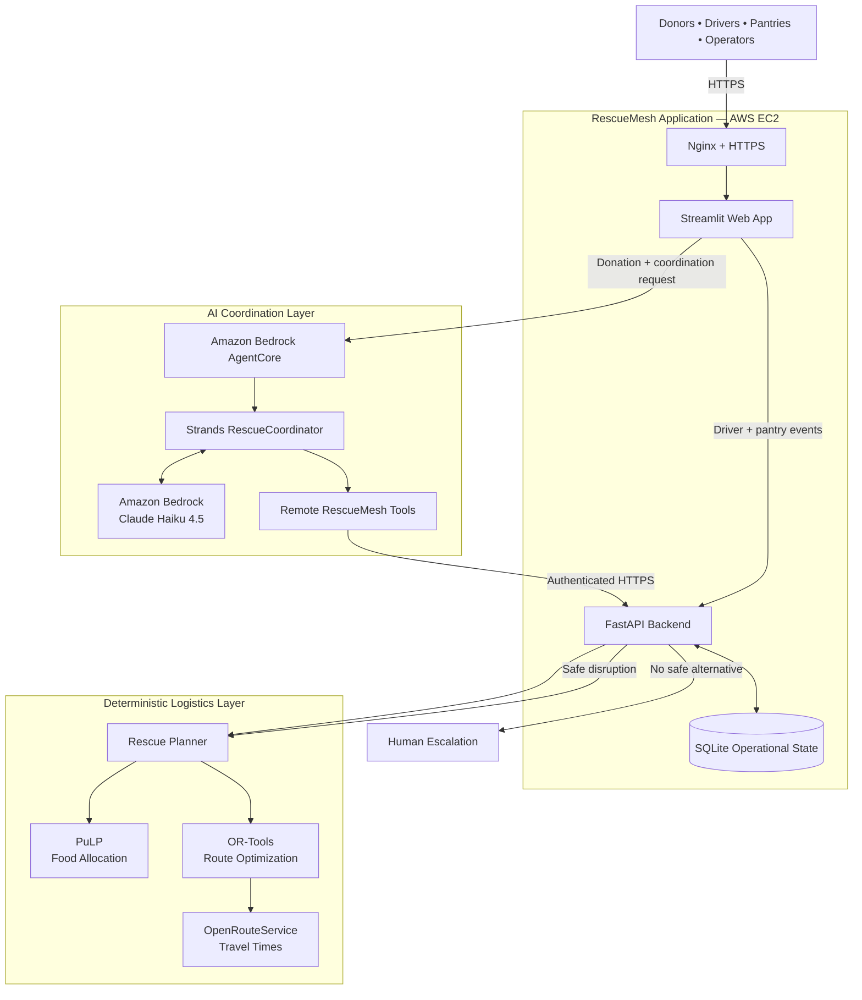

# RescueMesh

### Autonomous food rescue coordination with Strands Agents and Amazon Bedrock AgentCore

[](https://18-213-41-214.nip.io)


**RescueMesh** is an autonomous food-rescue coordination system that turns a surplus-food donation into an executable rescue operation.

It matches real-time pantry demand with available volunteer drivers, optimizes food allocation and delivery routes, tracks the rescue through pickup and verified delivery, and automatically replans when disruptions occur.

Unlike a chatbot that only recommends what people should do, RescueMesh coordinates the actual workflow across **donors, drivers, pantries, and operators** while preserving deterministic safety constraints and escalating to a human when no clearly safe option exists.

**Donation → AI coordination → deterministic planning → driver dispatch → delivery → pantry verification**

Built for the **AWS Agents for Humans Hackathon — Good Neighbor Agents** track to demonstrate an AI agent that performs real operational work for a real community need.

🌐 **Live Demo:**  
https://18-213-41-214.nip.io

---

## Try RescueMesh

The fastest way to understand RescueMesh is to run one complete rescue through the live application.

### Recommended Demo

Open the **Donor** page and create:

```text
Donor: Community Bakery
Food: Prepared Food
Quantity: 50 lbs
Available: 11:00
Pickup deadline: 14:00
```

Click:

**Create Donation & Start Rescue**

Then follow:

```text
Donor
  ↓
Driver Dispatch
  ↓
Live Rescue Demo
  ↓
Pantry Confirmation
  ↓
Operations
  ↓
Impact & Evaluation
```

During the rescue:

1. RescueMesh automatically creates the rescue plan.
2. **Driver Dispatch** shows the assigned driver, destinations, quantities, and ETAs.
3. **Live Rescue Demo** guides the driver through acceptance, pickup, and delivery.
4. **Pantry** independently confirms that food was actually received.
5. **Operations** shows the completed rescue and event history.
6. **Impact & Evaluation** shows measured system results.

The optimizer may choose different drivers or pantry combinations depending on the current network state. Always follow the plan RescueMesh actually generates.

> The Live Rescue Demo simulates events that would normally come from a driver's phone, SMS link, or lightweight mobile application. The events still use the real RescueMesh backend workflow.

---

## Why RescueMesh?

Food rescue is not only a matching problem. It is a coordination problem.

When surplus food becomes available, someone has to quickly determine:

- Which pantry currently needs this food?
- How much can each pantry accept?
- Which volunteer driver is available?
- Does the driver have enough capacity?
- Can pickup happen before the deadline?
- Can deliveries finish within the driver's shift?
- What happens if a driver cancels?
- What happens if a pantry becomes unavailable?
- When should the system automatically replan?
- When should automation stop and ask a human?

These decisions become difficult when donors, drivers, pantries, capacities, deadlines, and unexpected disruptions interact at the same time.

**RescueMesh turns that coordination problem into a stateful autonomous workflow.**

---

## How It Works

```text
Donor creates donation
        ↓
Strands RescueCoordinator
        ↓
Inspect donation + network state
        ↓
Deterministic logistics optimizer
        ↓
Assign pantry + driver + route
        ↓
Driver accepts and picks up food
        ↓
Driver reports delivery
        ↓
Pantry independently confirms receipt
        ↓
Rescue completed
```

If something changes during the rescue, RescueMesh evaluates the updated state and attempts a safe replan.

```text
Disruption
    ↓
Inspect latest network state
    ↓
Can a safe deterministic replacement be found?
    ↓
 ┌───────────────┴───────────────┐
 YES                             NO
  ↓                               ↓
Re-optimize                  Human escalation
  ↓
Continue rescue
```

If there is no clearly safe alternative, the system pauses instead of allowing the LLM to guess.

---

## Key Features

### 🤖 Autonomous Rescue Planning

A donor submission automatically triggers the Strands-based RescueCoordinator to inspect the donation and current network state and request a deterministic rescue plan.

### 🚚 Driver & Pantry Matching

RescueMesh allocates food to pantries with matching need and available capacity and assigns available volunteer drivers.

### 🗺️ Deterministic Logistics Optimization

**PuLP**, **Google OR-Tools**, and **OpenRouteService** handle food allocation, route construction, and road-network travel times.

### 🔄 Disruption Recovery

Driver failures, pantry closures, and capacity changes can trigger automatic replanning using the latest network state.

### 🧑 Human-in-the-Loop Safety

When RescueMesh cannot find a clearly safe deterministic alternative, it transitions the rescue to human review instead of allowing the AI agent to invent a decision.

### ✅ Two-Sided Delivery Verification

A driver reporting a delivery is not enough to complete a rescue.

The receiving pantry must independently confirm:

**Confirm Food Received**

Only then is the delivery considered verified.

### 📜 Persistent Operations and Events

RescueMesh stores donations, rescue operations, routes, delivery stops, events, and escalations as persistent state rather than keeping the workflow inside an LLM conversation.

---

## Architecture

> **LLMs orchestrate. Deterministic algorithms optimize.**

RescueMesh separates AI-driven coordination from deterministic logistics decisions.

The AI agent decides **what action should happen next**, while deterministic services calculate **how the rescue can actually be executed safely**.



### How the Architecture Is Divided

#### 1. AI Coordination

The `RescueCoordinator` is built with the **Strands Agents SDK** and deployed in **Amazon Bedrock AgentCore Runtime**.

The live RescueMesh application invokes AgentCore using an IAM-authorized AWS connection.

The agent is responsible for:

- inspecting the current rescue state;
- understanding what needs to happen next;
- selecting the appropriate RescueMesh tool;
- coordinating planning and recovery workflows;
- deciding when automation should continue;
- recognizing when human intervention is required.

Amazon Bedrock provides the foundation-model reasoning used by the Strands coordinator.

---

#### 2. Deterministic Logistics

The language model does **not** calculate logistics.

Instead, RescueMesh uses deterministic optimization services:

- **PuLP** — allocates donated food across eligible pantries;
- **Google OR-Tools** — builds feasible volunteer-driver delivery routes;
- **OpenRouteService** — provides road-network travel times used by the routing engine.

These services enforce operational constraints such as:

- donation quantity;
- pantry need;
- pantry capacity;
- driver capacity;
- driver availability;
- driver shifts;
- pickup deadlines;
- delivery feasibility.

This prevents the LLM from inventing quantities, routes, capacities, or ETAs.

---

#### 3. Operational State

The **FastAPI backend** provides the operational interface used by RescueMesh tools and application workflows.

**SQLite** stores persistent rescue state including:

```text
Donations
Pantries
Pantry needs
Drivers
Rescue operations
Driver routes
Delivery stops
Events
Human escalations
```

Because state is persisted outside the LLM conversation, RescueMesh can inspect previous actions, respond to disruptions, and continue an existing rescue reliably.

---

#### 4. Safe Remote Agent Tools

The AgentCore-hosted coordinator communicates with the RescueMesh backend using a restricted set of authenticated remote tools.

The agent can:

```text
Inspect donation
Inspect network state
Plan rescue
Inspect operation
Inspect operation events
Inspect pending escalations
Inspect escalation
```

These tools call the RescueMesh FastAPI backend over authenticated HTTPS.

The tool surface is intentionally limited so the AI coordinator cannot fabricate real-world events.

---

#### 5. Physical-World Event Boundary

Driver and pantry actions are kept separate from the AI agent.

The agent cannot pretend that:

```text
A driver accepted an assignment
Food was picked up
Food was delivered
A pantry confirmed receipt
A human approved an escalation
```

Those state changes must come through the corresponding RescueMesh workflow.

For example:

```text
Driver reports delivery
        ↓
Stop becomes driver_delivered
        ↓
Pantry independently confirms receipt
        ↓
Stop becomes completed
```

This creates two-sided delivery verification instead of trusting a single actor.

---

#### 6. Disruption Recovery

When something changes during an active rescue, the backend evaluates the updated state.

```text
Disruption
    ↓
Inspect latest network state
    ↓
Can a safe deterministic replacement be found?
    ↓
 ┌───────────────┴───────────────┐
 YES                             NO
  ↓                               ↓
Re-optimize                  Human escalation
  ↓
Continue rescue
```

Examples include:

- driver cancellation;
- driver becoming unavailable;
- pantry closure;
- pantry capacity changes;
- route feasibility changes.

If a safe deterministic alternative exists, RescueMesh can automatically replan.

If there is no clearly safe option, the operation transitions to human review instead of allowing the LLM to guess.

---

### Live Deployment Flow

The deployed application follows this path:

```text
User
 ↓
HTTPS
 ↓
Nginx on AWS EC2
 ↓
Streamlit
 ↓
EC2 IAM Role
 ↓
Amazon Bedrock AgentCore
 ↓
Strands RescueCoordinator
 ↓
Amazon Bedrock
 ↓
Remote RescueMesh Tool
 ↓
Authenticated HTTPS
 ↓
FastAPI
 ↓
PuLP + OR-Tools + OpenRouteService
 ↓
SQLite Rescue Operation
```

Driver and pantry events follow a separate trusted path:

```text
Driver / Pantry
      ↓
Streamlit
      ↓
FastAPI Event Processing
      ↓
Persistent Rescue State
      ↓
Continue / Replan / Escalate
```

This architecture allows RescueMesh to use AI for flexible coordination while keeping critical logistics calculations and physical-world state transitions deterministic and verifiable.

---

## Evaluation

RescueMesh was evaluated using automated tests and reproducible randomized logistics scenarios.

### Automated Tests

The project currently has:

**53 passing automated tests**

```bash
pytest tests/ -q
```

These tests cover planning constraints, driver availability, capacity limits, deadlines, routing behavior, disruption recovery, operation state, and workflow transitions.

### Randomized Logistics Benchmark

Using a reproducible benchmark with `seed=42`, RescueMesh was evaluated on **50 randomized planning scenarios**.

| Metric | Result |
|---|---:|
| Randomized planning scenarios | 50 |
| Rescue plans generated | 46 / 50 (92%) |
| Fully rescued scenarios | 46 / 50 (92%) |
| Safely rejected infeasible scenarios | 4 / 50 (8%) |
| Safety compliance among generated plans | 46 / 46 (100%) |
| Weighted food rescued | 89.62% |
| Capacity violations | 0 |
| Average planning latency | 6.42 s |
| P95 planning latency | 6.63 s |

All generated rescue plans passed the benchmark's independent safety checks.

When a randomized scenario had no feasible rescue, RescueMesh safely rejected it instead of producing an invalid plan.

### Disruption Recovery Benchmark

The benchmark also simulated **10 in-transit pantry-closure disruptions**.

| Metric | Result |
|---|---:|
| Disruption scenarios | 10 |
| Autonomous recoveries | 10 / 10 (100%) |
| Unsafe autonomous recoveries | 0 |
| Average disruption recovery latency | 0.79 s |

The 100% recovery result applies specifically to the tested in-transit pantry-closure scenarios and should not be interpreted as a 100% recovery rate for every possible disruption type.

### Reproduce the Benchmark

```bash
python evaluation/randomized_benchmark.py \
  --planning 50 \
  --disruptions 10 \
  --seed 42
```

Detailed outputs are stored in:

```text
evaluation/results/
├── planning_scenarios.csv
├── disruption_scenarios.csv
├── benchmark_summary.json
└── benchmark_summary.md
```

---

## Technology Stack

| Component | Technology |
|---|---|
| Agent Framework | Strands Agents SDK |
| Agent Runtime | Amazon Bedrock AgentCore |
| Foundation Model | Amazon Bedrock / Claude Haiku 4.5 |
| Frontend | Streamlit |
| Backend | FastAPI |
| Food Allocation | PuLP |
| Route Optimization | Google OR-Tools |
| Travel Times | OpenRouteService |
| Operational State | SQLite |
| Hosting | Amazon EC2 |
| Authorization | AWS IAM |
| Reverse Proxy | Nginx |
| HTTPS | Let's Encrypt |
| Language | Python |

---

## Run Locally

Clone the repository:

```bash
git clone https://github.com/maithili74/rescuemesh.git
cd rescuemesh
```

Create and activate a virtual environment:

```bash
python3 -m venv venv
source venv/bin/activate
```

Install dependencies:

```bash
pip install --upgrade pip
pip install -r requirements.txt
```

Create your environment file:

```bash
cp .env.example .env
```

Configure the required values:

```env
ORS_API_KEY=

RESCUEMESH_INTERNAL_API_KEY=

RESCUEMESH_BACKEND_URL=http://127.0.0.1:8000

AGENTCORE_RUNTIME_ARN=

AWS_REGION=us-east-1

AGENTCORE_QUALIFIER=DEFAULT
```

Never commit real secrets.

### Start the Backend

```bash
uvicorn app.api.main:app \
  --host 127.0.0.1 \
  --port 8000
```

### Start the Frontend

In another terminal:

```bash
streamlit run app/dashboard/streamlit_app.py
```

Then open:

```text
http://localhost:8501
```

For the deployed AgentCore path, the calling AWS environment must have permission to invoke the configured AgentCore runtime.

Without `AGENTCORE_RUNTIME_ARN`, RescueMesh can use the local Strands coordinator during development.

---

## Repository Structure

```text
rescuemesh/
│
├── app/
│   ├── agent/            # Strands + AgentCore integration
│   ├── api/              # FastAPI backend
│   ├── dashboard/        # Streamlit application
│   ├── services/         # Planning and routing services
│   └── tools/            # Agent tools
│
├── deploy/
│   └── agentcore/        # Lightweight AgentCore deployment package
│
├── evaluation/
│   ├── randomized_benchmark.py
│   └── results/
│
├── scripts/
├── tests/
│
├── .env.example
├── LICENSE
├── pyproject.toml
├── requirements.txt
└── README.md
```

---

## Limitations

RescueMesh is a hackathon prototype.

The current implementation uses:

- simulated donors, pantries, and volunteer drivers;
- SQLite instead of a distributed production database;
- web-based driver and pantry interfaces rather than production mobile applications;
- OpenRouteService for external routing data.

A production deployment would add stronger identity management, authentication, observability, monitoring, fault tolerance, and multi-user infrastructure.

---

## License

RescueMesh is licensed under the **MIT License**.

See [LICENSE](LICENSE).