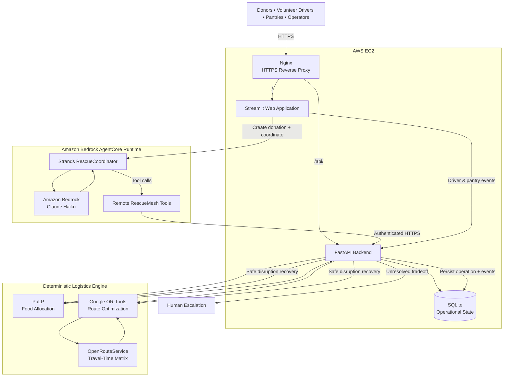

# RescueMesh

### Autonomous food rescue coordination powered by Strands Agents and Amazon Bedrock AgentCore

[](https://18-213-41-214.nip.io)


**RescueMesh** is an agentic food-rescue coordination system that connects surplus food from donors with community food pantries through available volunteer drivers.

Instead of simply recommending what someone should do, RescueMesh coordinates the rescue **end to end** — from donation intake and logistics planning to driver dispatch, disruption recovery, delivery, and independent pantry confirmation.

Built for the **AWS Agents for Humans Hackathon — Good Neighbor Agents** track.

🌐 **Live Application:**  
https://18-213-41-214.nip.io

---

## The Problem

Food rescue is not only a matching problem. It is a coordination problem.

When surplus food becomes available, someone must quickly determine:

- Which pantry currently needs this type of food?
- How much can each pantry accept?
- Which volunteer driver is available?
- Does the driver have enough vehicle capacity?
- Can pickup happen before the donation deadline?
- Can all deliveries be completed within the driver's shift?
- Should the food be split across multiple pantries?
- What happens if a driver suddenly cancels?
- What happens if a pantry becomes unavailable?
- When should the system automatically replan?
- When should automation stop and ask a human?

These decisions become difficult when donors, drivers, pantries, capacities, deadlines, and unexpected disruptions interact at the same time.

**RescueMesh turns that coordination problem into a stateful autonomous workflow.**

---

# What RescueMesh Does

A donor submits a surplus-food donation.

RescueMesh then:

1. inspects the donation;
2. inspects the current rescue network;
3. determines whether a feasible rescue exists;
4. allocates food across eligible pantries;
5. assigns available volunteer drivers;
6. creates optimized delivery routes;
7. stores the rescue as a persistent operation;
8. tracks driver acceptance, pickup, and delivery;
9. detects and responds to disruptions;
10. automatically replans when a safe alternative exists;
11. escalates genuine tradeoffs to a human when automation should stop;
12. requires independent pantry confirmation before delivery is considered complete.

The result is an AI agent that performs **real coordination work**, rather than simply generating recommendations.

---

# Core Design Principle

> ## LLMs orchestrate. Deterministic algorithms optimize.

RescueMesh intentionally does **not** ask a language model to calculate routes, quantities, capacities, travel times, or optimization results.

The AI agent handles:

- workflow reasoning;
- state inspection;
- tool selection;
- coordination;
- recovery decisions;
- deciding when more information is needed;
- deciding when human escalation is required.

Deterministic systems handle:

- food allocation;
- pantry capacity;
- pantry demand;
- driver capacity;
- driver availability;
- driver shifts;
- deadline constraints;
- route construction;
- travel-time calculations.

This hybrid architecture allows RescueMesh to use agentic reasoning without allowing an LLM to invent critical logistics facts.

---

# System Architecture



---

# Architecture Overview

RescueMesh separates **agentic coordination** from **deterministic logistics optimization**.

## 1. Agentic Coordination Layer

The main coordinator is built using the **Strands Agents SDK** and deployed to **Amazon Bedrock AgentCore Runtime**.

The RescueCoordinator uses Amazon Bedrock for reasoning and can call a restricted collection of RescueMesh tools.

The deployed agent can:

- inspect a donation;
- inspect the current rescue network;
- request a deterministic rescue plan;
- inspect an operation;
- inspect operation events;
- inspect pending escalations;
- inspect individual escalations.

The AgentCore runtime communicates with the RescueMesh FastAPI backend over authenticated HTTPS.

### Important safety boundary

The deployed AI agent is deliberately **not** given tools that allow it to fabricate real-world actions.

It cannot falsely claim that:

- a driver accepted an assignment;
- food was picked up;
- food was delivered;
- a pantry confirmed receipt;
- a human approved an escalation.

Those events must come through their corresponding RescueMesh interfaces.

---

## 2. Deterministic Logistics Layer

Mathematical logistics decisions are handled outside the LLM.

### PuLP

PuLP performs donation-to-pantry allocation while respecting constraints such as:

- pantry need;
- remaining pantry capacity;
- available donation quantity.

### Google OR-Tools

OR-Tools handles driver routing and delivery sequencing.

The planner evaluates constraints including:

- driver availability;
- driver capacity;
- shift limits;
- pickup timing;
- delivery timing;
- route feasibility.

### OpenRouteService

OpenRouteService provides road-network travel-time information used by the routing engine.

The language model does not invent travel times or routes.

---

# End-to-End Rescue Lifecycle

```text
Donation Created
       │
       ▼
Agent Inspects Donation
       │
       ▼
Agent Inspects Network State
       │
       ▼
Deterministic Rescue Planner
       │
       ├── Pantry Allocation
       ├── Driver Assignment
       └── Route Optimization
       │
       ▼
Rescue Operation Created
       │
       ▼
Driver Accepts Assignment
       │
       ▼
Driver Confirms Pickup
       │
       ▼
Driver Reports Delivery
       │
       ▼
Pantry Independently Confirms Receipt
       │
       ▼
Rescue Completed
```

---

# Verified Delivery

RescueMesh uses **two-sided delivery confirmation**.

When a driver reports that food has been delivered, the delivery stop enters:

```text
driver_delivered
```

The rescue is **not** considered fully complete yet.

The receiving pantry must separately confirm:

```text
Confirm Food Received
```

Only then does the stop become completed.

This prevents a single participant from being the sole source of truth for delivery completion.

---

# Disruption Recovery

Real rescue operations do not always follow the original plan.

RescueMesh supports disruptions such as:

- driver cancellation;
- driver becoming unavailable;
- pantry closure;
- pantry capacity changes;
- route feasibility changes.

When a disruption occurs, RescueMesh reevaluates the latest network state.

```text
Disruption
    │
    ▼
Inspect Updated State
    │
    ▼
Can a Safe Alternative Be Found?
    │
    ├── YES ──► Re-optimize ──► Continue Rescue
    │
    └── NO ───► Human Escalation
```

If a safe deterministic alternative exists, RescueMesh can automatically produce a replacement plan.

If no clearly safe solution exists, the system does **not** ask the LLM to guess.

Instead, the operation enters:

```text
awaiting_human
```

---

# Human-in-the-Loop Safety

RescueMesh intentionally limits autonomous decision-making when genuine tradeoffs require human judgment.

```text
Routine coordination
        │
        ▼
Autonomous

Safe disruption with a deterministic alternative
        │
        ▼
Autonomous Replanning

Ambiguous or consequential tradeoff
        │
        ▼
Human Decision
```

The agent may inspect an escalation and explain the situation, but it cannot approve or reject the decision on behalf of the human operator.

---

# Key Features

## Autonomous Rescue Planning

Creating a donation can automatically trigger the Strands-based RescueCoordinator.

The coordinator inspects the donation, evaluates network state, and invokes deterministic planning tools.

---

## Pantry Allocation

A single donation can be allocated across one or more eligible pantries according to actual need and capacity.

---

## Volunteer Driver Assignment

RescueMesh identifies available drivers while respecting operational constraints such as vehicle capacity and working shifts.

---

## Route Optimization

Delivery routes are generated using deterministic optimization rather than LLM-generated guesses.

---

## Stateful Operations

Every rescue is stored as a persistent operation rather than existing only inside a chatbot conversation.

---

## Event History

Important rescue actions are recorded for transparency and later inspection.

---

## Autonomous Replanning

Recoverable disruptions can trigger a new optimization pass based on the latest network state.

---

## Human Escalation

When automation cannot safely resolve a situation, RescueMesh pauses and asks for human input.

---

## Verified Delivery

Driver delivery and pantry receipt are tracked separately.

---

## Live Rescue Demo

The application includes a guided rescue experience that walks users through:

```text
Plan
  ↓
Accepted
  ↓
Picked Up
  ↓
Delivered
  ↓
Verified
  ↓
Complete
```

---

# RescueMesh Interfaces

The Streamlit application provides six primary views.

### Donor

Create surplus-food donations and start the rescue coordination workflow.

### Driver Dispatch

View driver assignments, pickup information, delivery stops, quantities, and ETAs.

### Pantry

View inbound food and independently confirm received deliveries.

### Operations

Inspect rescue operations, status, event history, and human escalations.

### Impact & Evaluation

Review system-level evaluation and rescue outcomes.

### Live Rescue Demo

Walk through a rescue lifecycle using guided simulated events.

The simulation buttons represent events that would normally originate from a driver's phone, SMS link, or lightweight mobile application.

They still use the actual RescueMesh backend event-processing logic.

---

# Agent Tools

The deployed RescueCoordinator has access to a deliberately restricted tool set.

```text
inspect donation
inspect network state
plan rescue
inspect operation
inspect operation events
inspect pending escalations
inspect escalation
```

The remote tools call the RescueMesh backend over authenticated HTTPS.

The AgentCore coordinator does **not** receive tools for:

```text
approving human escalations
rejecting human escalations
pretending a driver accepted
pretending food was picked up
pretending food was delivered
pretending a pantry confirmed receipt
```

This separation protects the integrity of real-world workflow state.

---

# AWS Deployment

The live RescueMesh application uses:

- **Amazon EC2** — application hosting;
- **Amazon Bedrock AgentCore Runtime** — deployed Strands agent;
- **Amazon Bedrock** — foundation-model inference;
- **AWS IAM** — secure EC2 → AgentCore authorization;
- **Nginx** — HTTPS reverse proxy;
- **Let's Encrypt** — TLS certificate;
- **systemd** — persistent application services.

The EC2 instance runs:

```text
127.0.0.1:8501 → Streamlit
127.0.0.1:8000 → FastAPI
```

Nginx exposes them through HTTPS:

```text
/      → Streamlit
/api/  → FastAPI
```

The public application is available at:

**https://18-213-41-214.nip.io**

---

# Why Amazon Bedrock AgentCore?

AgentCore is not used as a decorative deployment layer.

The **real RescueCoordinator** runs inside Amazon Bedrock AgentCore Runtime.

The live website invokes that runtime using an IAM role attached to the EC2 instance.

The production coordination path is:

```text
Streamlit
    │
    ▼
EC2 IAM Role
    │
    ▼
Amazon Bedrock AgentCore Runtime
    │
    ▼
Strands RescueCoordinator
    │
    ▼
Amazon Bedrock
    │
    ▼
Remote RescueMesh Tools
    │
    ▼
Authenticated HTTPS
    │
    ▼
FastAPI
    │
    ▼
Deterministic Optimization
    │
    ▼
Persistent Rescue Operation
```

This flow is used by the live application.

---

# Technology Stack

| Layer | Technology |
|---|---|
| Agent Framework | Strands Agents SDK |
| Agent Runtime | Amazon Bedrock AgentCore |
| Foundation Model | Amazon Bedrock / Claude Haiku |
| Frontend | Streamlit |
| Backend | FastAPI |
| Allocation Optimization | PuLP |
| Route Optimization | Google OR-Tools |
| Travel-Time Data | OpenRouteService |
| Operational State | SQLite |
| Cloud Hosting | Amazon EC2 |
| Cloud Authorization | AWS IAM |
| Reverse Proxy | Nginx |
| HTTPS | Let's Encrypt |
| Language | Python |

---

# Live Demo Walkthrough

The easiest way to evaluate RescueMesh is through the deployed application.

## Step 1 — Create a Rescue

Open **Donor**.

A recommended demo scenario is:

```text
Donor: Community Bakery
Food: Prepared Food
Quantity: 50 lbs
Available: 11:00
Pickup deadline: 14:00
```

Click:

```text
Create Donation & Start Rescue
```

RescueMesh invokes the real Strands + AgentCore coordination workflow and deterministic logistics engine.

---

## Step 2 — Review the Dispatch

Open **Driver Dispatch**.

The generated rescue shows information such as:

- assigned volunteer driver;
- pickup time;
- assigned quantity;
- pantry destination;
- stop sequence;
- estimated arrival time.

---

## Step 3 — Follow the Rescue

Open **Live Rescue Demo**.

The guided progress tracker displays:

```text
Plan → Accepted → Picked Up → Delivered → Verified → Complete
```

The interface highlights the next valid event.

---

## Step 4 — Verify Delivery

After the driver reports delivery, open **Pantry**.

Select the receiving pantry and click:

```text
Confirm Food Received
```

This creates the independent pantry-side confirmation.

---

## Step 5 — Review the Completed Rescue

Open **Operations** to inspect the completed operation and event history.

Then open **Impact & Evaluation** to review system evaluation information.

> RescueMesh may select a different driver or pantry depending on the current network state. Always follow the rescue plan the system actually generates.

---

# Evaluation

RescueMesh is evaluated at both the software and operational levels.

## Automated Test Suite

The current codebase maintains:

> **53 passing automated tests**

Tests cover core rescue planning, operation state, workflow behavior, and safety-related logic.

Run the suite with:

```bash
pytest tests/ -q
```

Expected current result:

```text
53 passed
```

---

## Rescue-System Evaluation

The evaluation framework measures operational behavior rather than only checking whether an API call succeeds.

Metrics include:

- total rescue scenarios;
- feasible-plan success;
- fully rescued donations;
- partially rescued donations;
- safely rejected donations;
- percentage of food rescued;
- autonomous disruption recovery;
- human escalation frequency;
- planning latency;
- capacity violations;
- driver double-booking violations;
- shift violations;
- deadline violations;
- invalid completed deliveries.

The final benchmark numbers are generated from the RescueMesh evaluation harness rather than estimated manually.

---

# Safety Checks

A RescueMesh plan must respect operational constraints.

Examples include:

```text
Driver capacity
Driver availability
Driver shift
Driver double booking
Pantry capacity
Pantry need
Pickup deadline
Delivery feasibility
Delivery confirmation state
```

The AI coordinator is explicitly instructed not to invent missing operational facts.

If the deterministic planner cannot safely generate a valid plan, the system must:

```text
reject safely
       OR
partially recover
       OR
escalate to a human
```

rather than fabricate a solution.

---

# Project Structure

```text
rescuemesh/
│
├── app/
│   │
│   ├── agent/
│   │   ├── rescue_coordinator.py
│   │   ├── agentcore_runtime.py
│   │   └── agentcore_client.py
│   │
│   ├── api/
│   │   └── main.py
│   │
│   ├── dashboard/
│   │   ├── streamlit_app.py
│   │   ├── services/
│   │   └── views/
│   │
│   ├── services/
│   │
│   └── tools/
│       └── remote_tools.py
│
├── deploy/
│   └── agentcore/
│       ├── app/
│       └── pyproject.toml
│
├── tests/
│
├── .env.example
├── .gitignore
├── LICENSE
├── pyproject.toml
└── README.md
```

---

# Environment Configuration

Create your local environment file:

```bash
cp .env.example .env
```

Example configuration:

```env
# OpenRouteService
ORS_API_KEY=

# RescueMesh internal API authentication
RESCUEMESH_INTERNAL_API_KEY=

# Backend URL
RESCUEMESH_BACKEND_URL=http://127.0.0.1:8000

# Amazon Bedrock AgentCore
AGENTCORE_RUNTIME_ARN=

AWS_REGION=us-east-1

AGENTCORE_QUALIFIER=DEFAULT
```

Never commit real secrets.

The repository's `.gitignore` excludes `.env`.

---

# Running Locally

Clone the repository:

```bash
git clone <YOUR_PUBLIC_GITHUB_REPOSITORY_URL>
cd rescuemesh
```

Create a virtual environment:

```bash
python3 -m venv venv
source venv/bin/activate
```

Upgrade pip:

```bash
pip install --upgrade pip
```

Install the project dependencies using the dependency configuration included in the repository.

Configure the environment:

```bash
cp .env.example .env
```

Add the required values to `.env`.

---

## Start the FastAPI Backend

```bash
uvicorn app.api.main:app \
    --host 127.0.0.1 \
    --port 8000
```

---

## Start the Streamlit Application

In another terminal:

```bash
streamlit run app/dashboard/streamlit_app.py
```

Open:

```text
http://localhost:8501
```

---

## AgentCore Configuration

For the deployed AgentCore path, configure:

```env
AGENTCORE_RUNTIME_ARN=
AWS_REGION=us-east-1
AGENTCORE_QUALIFIER=DEFAULT
```

The calling environment must also have AWS permission to invoke the configured AgentCore runtime.

For local development without an AgentCore runtime ARN, RescueMesh can use the local Strands coordinator.

---

# Testing

Run all tests:

```bash
pytest tests/ -q
```

Current expected result:

```text
53 passed
```

---

# Security

RescueMesh uses several security boundaries:

- secrets are provided through environment variables;
- `.env` is excluded from Git;
- AWS credentials are not stored in the repository;
- EC2 accesses AgentCore through an IAM role;
- AgentCore remote tools authenticate to the backend;
- FastAPI is bound internally rather than publicly exposing port `8000`;
- Streamlit is bound internally rather than publicly exposing port `8501`;
- public traffic enters through Nginx over HTTPS;
- AgentCore tools exclude human-approval actions;
- AgentCore tools exclude simulated physical-world events.

---

# Third-Party Services

RescueMesh uses **OpenRouteService** for road-network travel-time calculations.

Third-party services are used according to their respective terms and licensing requirements.

---

# Current Limitations

RescueMesh is a hackathon prototype designed to demonstrate an end-to-end agentic rescue workflow.

Current limitations include:

- SQLite is used instead of a distributed production database;
- the rescue network uses simulated donors, pantries, drivers, and events;
- driver events are demonstrated through the web interface rather than a production mobile application;
- pantry confirmation is demonstrated through the web portal;
- routing depends on OpenRouteService availability;
- a production implementation would require stronger identity management, authentication, observability, monitoring, and multi-tenant controls.

These limitations are intentionally separated from the core coordination architecture so the prototype can clearly demonstrate autonomous rescue orchestration.

---

# Why RescueMesh Is Agentic

RescueMesh is not simply:

```text
User → Prompt → LLM → Text Response
```

Instead, it operates as:

```text
Observe State
      ↓
Reason About the Rescue
      ↓
Select a Tool
      ↓
Execute Real Backend Work
      ↓
Observe the Updated State
      ↓
Continue / Replan / Escalate
```

The agent participates in an ongoing operational workflow with persistent state and deterministic tools.

That is what allows RescueMesh to move beyond chat and perform real coordination work.

---

# Hackathon

RescueMesh was created for the:

## AWS Agents for Humans Hackathon

Track:

### Good Neighbor Agents

The project explores how agentic AI can coordinate a practical community task while maintaining deterministic safety constraints and explicit human oversight when necessary.

---

# License

RescueMesh is licensed under the **MIT License**.

See [`LICENSE`](LICENSE) for details.